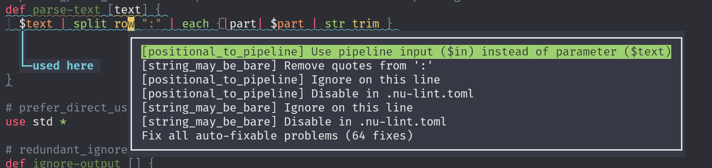
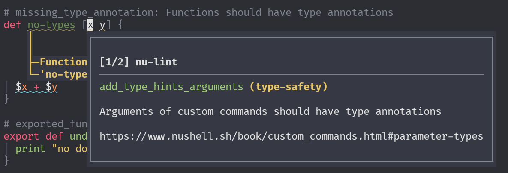
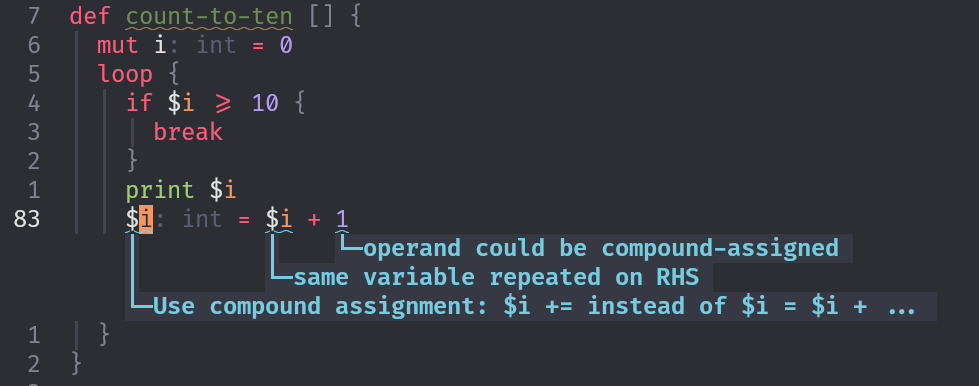
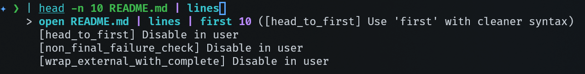

# Nu-Lint

Linter for the innovative [Nu](https://www.nushell.sh/) shell.

Learning to use a new shell is a radical change that can use some assistance. This project is aimed at helping new and intermediate users of the [Nu](https://www.nushell.sh/) shell. Nu shell has a lot of useful features not found in other scripting languages. This linter will give you hints to use all of them and even offer automatic fixes.

## Usage

Lint all Nu files in working directory with:

```bash
nu-lint
```

To see all options and get help:

```bash
nu-lint --help
```

## Screenshots

Following screenshots were taking in Helix with `nu-lint` set-up as LSP (`nu-lint --lsp`).

- Automatic fixes and ignore actions (with keybinding `space a` in Helix): 
- Explanations in popup (with keybinding with `space k` in Helix): 
- Inline hints (opt-in in most editors) 

To have `nu-lint` in your terminal directly (not just scripts), use [nushell-lsp](https://github.com/wvhulle/nushell):

- Real-time diagnostics while typing in Nushell prompt: 
- Fixes (and ignore actions) offered in Nushell prompt 

## Rule example

The rule `turn_positional_into_stream_input` recommends to use pipelines instead of positional arguments:

```nu
def filter-positive [numbers] {
    $numbers | where $it > 0
}
```

```nu
def filter-positive [] {
    where $it > 0
}
```

This encourages lazy pipeline input: a positional list argument loads all data into memory at once, while implicit pipeline input processes elements one at a time.

## Rules

All rules are optional and can be disabled with a configuration file or comment. The rule definitions are compatible with:

- The official Nu parser [nu-parser](https://crates.io/crates/nu-parser).
- The Tree-sitter-based Nu formatter [topiary-nushell](https://github.com/blindFS/topiary-nushell).
- The official Nu [style guide](https://www.nushell.sh/book/style_guide.html)

Some of the rules need further testing and improvement. Please make an issue on the issue tracker to report any bugs. In early stages of development some rules may be replaced or renamed.

+150 rules are defined and most have automatic fixes available (list may be out-of-date):

<!-- start-rule-groups -->

`idioms` - Simplifications unique to the Nu language.

- `not_is_empty_to_is_not_empty` (auto-fix): Simplify `not ... is-empty` to `is-not-empty`
- `columns_in_to_has` (auto-fix): Use 'has' operator instead of 'in ($record | columns)'
- `columns_not_in_to_not_has` (auto-fix): Simplify `not-in columns` to `not-has`
- `dispatch_with_subcommands`: Match dispatch replaceable with subcommands
- `get_optional_to_has` (auto-fix): Simplify `get -o | is-not-empty` to `has`
- `get_optional_to_not_has` (auto-fix): Simplify `get -o | is-empty` to `not-has`
- `hardcoded_math_constants` (auto-fix): Hardcoded mathematical constants should use std/math constants instead
- `transpose_items` (auto-fix): Simplify `transpose | each` to `items`
- `merge_get_cell_path` (auto-fix): Combine chained 'get' commands into cell paths
- `merge_multiline_print` (auto-fix): Consecutive prints mergeable into one
- `positional_to_pipeline` (auto-fix): Data parameter convertible to pipeline input
- `source_to_use`: `source` replaceable with `use`
- `compound_assignment` (auto-fix): Compound assignment operators simplify simple arithmetic.
- `contains_to_regex_op` (auto-fix): Use =~ and !~ operators instead of verbose 'str contains' checks
- `ansi_over_escape_codes` (auto-fix): Raw ANSI escape replaceable with `ansi`
- `append_to_concat_assign` (auto-fix): Use ++= operator instead of verbose append in assignment
- `custom_log_command` (auto-fix): Custom log command shadows stdlib. Use `use std/log` instead
- `chained_append` (auto-fix): Use spread syntax instead of chained 'append' commands
- `use_record_spread` (auto-fix): Use record spread for consecutive field assignments
- `use_load_env` (auto-fix): Use load-env for multiple $env assignments
- `remove_hat_not_builtin` (auto-fix): Detect unnecessary '^' prefix on external commands

`parsing` - Better ways to parse and transform text data.

- `lines_instead_of_split` (auto-fix): Use 'lines' command for splitting by newlines
- `never_space_split` (auto-fix): Unnecessary quotes around variable
- `lines_each_to_parse` (auto-fix): Remove redundant 'each' wrapper around 'parse'
- `simplify_regex_parse` (auto-fix): Simplify 'parse --regex' to 'parse' with pattern syntax
- `split_row_get_multistatement` (auto-fix): Extract field directly with 'parse' instead of storing split result
- `split_first_to_parse` (auto-fix): Extract first field with 'parse' pattern
- `split_row_get_inline` (auto-fix): Extract field by name with 'parse' pattern
- `split_row_space_to_split_words` (auto-fix): Use 'split words' for whitespace splitting

`filesystem` - Simplify file and path operations.

- `from_after_parsed_open` (auto-fix): `open` already parses known formats into structured data
- `open_raw_from_to_open` (auto-fix): Simplify `open --raw | from` to `open`
- `string_param_as_path` (auto-fix): Parameter typed as string but used as filesystem path

`dead-code` - Remove unused or redundant code

- `self_import`: Circular import: script imports itself
- `unnecessary_accumulate`: Redundant accumulator pattern: can be simplified
- `assign_then_return` (auto-fix): Redundant variable before return
- `do_not_compare_booleans` (auto-fix): Redundant comparison with boolean literal
- `if_null_to_default` (auto-fix): Simplify if-null pattern to `| default`
- `redundant_ignore` (auto-fix): Commands producing output that is discarded with '| ignore'
- `unnecessary_mut` (auto-fix): Variable marked `mut` but never reassigned
- `unused_helper_functions` (auto-fix): Function unreachable from entry points
- `unused_parameter` (auto-fix): Function parameter declared but never used
- `unused_variable` (auto-fix): Variable declared but never used
- `script_export_main` (auto-fix): In scripts, 'def main' is the entry point and doesn't need 'export'
- `string_may_be_bare` (auto-fix): Quoted string can be bare word
- `single_call_command` (auto-fix): Single-line command called only once
- `append_to_concat_assign` (auto-fix): Use ++= operator instead of verbose append in assignment

`posix` - Replace common bash/POSIX patterns.

- `ignore_over_dev_null` (auto-fix): Use '| ignore' instead of redirecting to /dev/null
- `awk_to_pipeline` (auto-fix): `awk` replaceable with structured pipeline
- `bat_to_open` (auto-fix): `bat` replaceable with `open` for file viewing
- `cat_to_open` (auto-fix): External `cat` replaceable with `open`
- `date_to_date_now` (auto-fix): External `date` replaceable with `date now`
- `df_to_sys_disks` (auto-fix): `df` replaceable with `sys disks`
- `redundant_echo` (auto-fix): Redundant `echo` (identity function)
- `find_to_glob` (auto-fix): `find` replaceable with `glob` or `ls`
- `free_to_sys_mem` (auto-fix): `free` replaceable with `sys mem` for memory info
- `grep_to_find_or_where` (auto-fix): `grep` replaceable with `find` or `where`
- `head_to_first` (auto-fix): `head` replaceable with `first`
- `hostname_to_sys_host` (auto-fix): `hostname` replaceable with `sys host`
- `external_cd_to_builtin` (auto-fix): External `cd` replaceable with built-in `cd`
- `external_ls_to_builtin` (auto-fix): External `ls` replaceable with built-in
- `pager_to_explore` (auto-fix): Pager replaceable with `explore`
- `read_to_input` (auto-fix): `read` replaceable with `input`
- `sed_to_str_transform` (auto-fix): `sed` replaceable with `str replace`
- `external_sort_to_builtin` (auto-fix): External `sort` replaceable with built-in
- `tac_to_reverse` (auto-fix): `tac` replaceable with `lines | reverse`
- `tail_to_last` (auto-fix): `tail` replaceable with `last`
- `uname_to_sys_host` (auto-fix): `uname` replaceable with `sys host`
- `external_uniq_to_builtin` (auto-fix): External `uniq` replaceable with built-in
- `uptime_to_sys_host` (auto-fix): `uptime` replaceable with `sys host`
- `users_to_sys_users` (auto-fix): `users` replaceable with `sys users`
- `w_to_sys_users` (auto-fix): `w` replaceable with `sys users`
- `wc_to_length` (auto-fix): `wc` replaceable with `length`
- `who_to_sys_users` (auto-fix): `who` replaceable with `sys users`

`iteration` - Better patterns for loops and iteration.

- `loop_counter_to_range`: Loop counter to range iteration
- `while_counter_to_range`: Counter while-loop to range iteration

`runtime-errors` - Preventing unexpected runtime behaviour.

- `add_hat_external_commands` (auto-fix): Always use the '^' prefix on external commands
- `fragile_last_exit_code` (auto-fix): Fragile `LAST_EXIT_CODE` check
- `check_complete_exit_code`: Unchecked exit code after `complete`
- `descriptive_error_messages`: Error messages should be descriptive and actionable
- `unescaped_interpolation`: Unescaped braces in string interpolation
- `exit_only_in_main`: Avoid using 'exit' in functions other than 'main'
- `check_typed_flag_before_use`: Typed flag used without null check
- `non_final_failure_check`: Non-final pipeline command exit code ignored
- `error_make_for_non_fatal` (auto-fix): Use 'error make' for catchable errors in functions and try blocks
- `try_instead_of_do`: Use 'try' blocks instead of 'do' blocks for error-prone operations
- `unsafe_dynamic_record_access` (auto-fix): Use 'get -o' for dynamic keys to handle missing keys safely
- `missing_stdin_in_shebang` (auto-fix): Shebang missing `--stdin` for input
- `dynamic_script_import`: Dynamic import path not statically validated
- `catch_builtin_error_try`: Catch runtime errors from built-in commands using 'try' blocks
- `unchecked_cell_path_index` (auto-fix): Cell path numeric index access may panic on empty lists
- `unchecked_get_index` (auto-fix): Prefer optional cell path `$list.0?` over `get` for index access
- `wrap_external_with_complete`: External command missing `complete` wrapper
- `source_to_use`: `source` replaceable with `use`
- `spread_list_to_external` (auto-fix): List variables passed to external commands should be spread with `...`
- `glob_may_drop_quotes` (auto-fix): Quoted glob pattern treated as literal
- `require_main_with_stdin`: Scripts using $in must define a main function

`filtering` - Better patterns for filtering and selecting data.

- `each_if_to_where` (auto-fix): Use 'where' for filtering instead of 'each' with 'if'
- `for_filter_to_where`: Use 'where' filter instead of for loop with if and append
- `omit_it_in_row_condition` (auto-fix): Field names in 'where' row conditions don't need `$it.` prefix
- `slice_to_drop` (auto-fix): Use 'drop' instead of 'slice ..-N' to drop last N-1 elements
- `slice_to_last` (auto-fix): Use 'last' instead of 'slice (-N)..' to get last N elements
- `slice_to_skip` (auto-fix): Use 'skip' instead of 'slice N..' to skip first N elements
- `slice_to_take` (auto-fix): Use 'take' instead of 'slice 0..N' to take first N elements
- `where_closure_drop_parameter` (auto-fix): You can drop the closure and its parameter in 'where' and 'filter'.
- `remove_redundant_in` (auto-fix): Redundant `$in` at pipeline start

`performance` - Rules with potential performance impact

- `redundant_nu_subprocess`: Redundant `nu -c` subprocess call
- `dispatch_with_subcommands`: Match dispatch replaceable with subcommands
- `self_import`: Circular import: script imports itself
- `positional_to_pipeline` (auto-fix): Data parameter convertible to pipeline input
- `unnecessary_accumulate`: Redundant accumulator pattern: can be simplified
- `merge_multiline_print` (auto-fix): Consecutive prints mergeable into one
- `chained_str_transform` (auto-fix): Consecutive `str replace` combinable
- `streaming_hidden_by_complete` (auto-fix): Streaming commands should not be wrapped with 'complete'
- `chained_append` (auto-fix): Use spread syntax instead of chained 'append' commands

`type-safety` - Annotate with type hints where possible.

- `external_script_as_argument`: Script path passed as command argument
- `nothing_outside_signature` (auto-fix): `nothing` type used outside signature
- `add_type_hints_arguments` (auto-fix): Arguments of custom commands should have type annotations
- `string_param_as_path` (auto-fix): Parameter typed as string but used as filesystem path
- `missing_output_type` (auto-fix): Command missing output type annotation
- `missing_in_type` (auto-fix): Command using `$in` missing input type
- `redundant_nu_subprocess`: Redundant `nu -c` subprocess call
- `dynamic_script_import`: Dynamic import path not statically validated

`documentation` - Improve usefullness user-facing messages.

- `add_doc_comment_exported_fn`: Exported functions should have documentation comments
- `descriptive_error_messages`: Error messages should be descriptive and actionable
- `add_label_to_error`: error make should include 'label'
- `add_help_to_error`: `error make` missing `help` field
- `add_span_to_label`: labels should include 'span' to highlight error location in user code
- `add_url_to_error`: error make should include 'url' field to link to documentation
- `main_positional_args_docs`: Missing docs on main positional parameter
- `main_named_args_docs`: Missing docs on main flag parameter
- `max_positional_params`: Custom commands should have ≤ 2 positional parameters
- `explicit_long_flags` (auto-fix): Replace short flags (-f) with long flags (--flag)
- `list_param_to_variadic` (auto-fix): Use variadic `...args` instead of a single list parameter

`effects` - Handle built-in and external commands with side-effects.

- `dangerous_file_operations`: File operation on dangerous system path
- `errors_to_stderr`: Error messages should go to stderr, not stdout
- `dont_mix_different_effects`: Functions should not mix different types of I/O operations or effects.
- `print_and_return_data`: Function prints and returns data
- `each_nothing_to_for_loop` (auto-fix): `each` mappings with no output should be written as `for` loops.
- `silence_stderr_data`: External commands that write data to stderr should not be silenced

`external` - Replace common external CLI tools.

- `curl_to_http` (auto-fix): `curl` replaceable with `http` commands
- `fd_to_glob` (auto-fix): `fd` replaceable with `glob` or `ls`
- `jq_to_nu_pipeline` (auto-fix): Simple `jq` filter replaceable with Nushell pipeline
- `wget_to_http_get` (auto-fix): `wget` replaceable with `http get`
- `external_which_to_builtin` (auto-fix): External `which` replaceable with built-in
- `structured_data_to_csv_tool` (auto-fix): Table piped to CSV tool without `to csv`
- `structured_data_to_json_tool` (auto-fix): Data piped to JSON tool without `to json`

`formatting` - Formatting according to style-guide.

- `ansi_over_escape_codes` (auto-fix): Raw ANSI escape replaceable with `ansi`
- `collapsible_if` (auto-fix): Nested if-statements collapsible with `and`
- `forbid_excessive_nesting`: Avoid excessive nesting (more than 4 levels deep)
- `max_function_body_length`: Function bodies should be short to maintain readability
- `if_else_chain_to_match` (auto-fix): Use 'match' for value-based branching instead of if-else-if chains
- `block_brace_spacing` (auto-fix): Block body needs spaces inside braces: `{ body }` not `{body}`
- `closure_brace_pipe_spacing` (auto-fix): Space between `{` and `|` in closure
- `closure_pipe_body_spacing` (auto-fix): Closure body needs spaces: `{|x| body }` not `{|x|body}`
- `no_trailing_spaces` (auto-fix): Eliminate trailing spaces at the end of lines
- `omit_list_commas` (auto-fix): Omit commas between list items.
- `pipe_spacing` (auto-fix): Inconsistent spacing around `|`
- `record_brace_spacing` (auto-fix): Record braces should touch content: `{a: 1}` not `{ a: 1 }`
- `reflow_wide_pipelines` (auto-fix): Pipeline exceeds line length limit
- `reflow_wide_lists` (auto-fix): Wrap wide lists vertically across multiple lines.
- `wrap_wide_records` (auto-fix): Wrap records exceeding 80 chars or with deeply nested structures

`naming` - Follow official naming conventions

- `kebab_case_commands`: Custom commands should use kebab-case naming convention
- `screaming_snake_constants`: Constants should use SCREAMING_SNAKE_CASE naming convention
- `snake_case_variables` (auto-fix): Variables should use snake_case naming convention
- `add_label_to_error`: error make should include 'label'

`upstream` - Forward warnings and errors of the Nu parser.

- `dynamic_script_import`: Dynamic import path not statically validated
- `nu_deprecated` (auto-fix): Parser detected deprecated command or flag usage
- `nu_parse_error`: Parser encountered a syntax error

<!-- end-rule-groups -->

## Installation

### Recommended

The type installation that will always work on your system. From crates.io:

```bash
cargo install nu-lint
```

No system dependencies are required.

### Source

Build from source:

```bash
cargo install --path .
```

From latest git main branch:

```bash
cargo install --git https://codeberg.org/wvhulle/nu-lint
```

### Nix

Run without installing permanently (using flakes):

```bash
nix run git+https://codeberg.org/wvhulle/nu-lint
```

### Pre-Compiled Binaries

Download the appropriate binary from the releases subpage. (Not always the most up-to-date, prefer Crates.io releases)

## Editor extension

### VS Code extension

Available at [VS Code Marketplace](https://marketplace.visualstudio.com/items?itemName=WillemVanhulle.nu-lint).

### Helix

Add to your `~/.config/helix/languages.toml`:

```toml
[language-server.nu-lint]
command = "nu-lint"
args = ["--lsp"]

[[language]]
name = "nu"
language-servers = ["nu-lint"]
```

The official Nu LSP server offers completion and some other hints. It should be configured out of the box for new Helix installations and environments that have Nushell installed.

### Neovim

Add to your Neovim configuration (Lua):

```lua
vim.lsp.config['nu-lint'] = {
  cmd = { 'nu-lint', '--lsp' },
  filetypes = { 'nu' },
  root_markers = { '.git' }
}
vim.lsp.enable('nu-lint')
```

You may want to configure official Nu language server in addition to this linter, see `nu --lsp` command.

### Emacs

Add to your Emacs configuration (with Eglot, built-in since Emacs 29):

```elisp
(with-eval-after-load 'eglot
  (add-to-list 'eglot-server-programs
               '(nushell-mode "nu-lint" "--lsp")))
```

### Kate

Add to your `~/.config/kate/lspclient/settings.json`:

```json
{
  "servers": {
    "nushell": {
      "command": ["nu-lint", "--lsp"],
      "highlightingModeRegex": "^Nushell$"
    }
  }
}
```

### Zed

Available as [`Nu-Lint` extension](https://codeberg.org/vmeurisse/nu-lint-zed#readme).

### Other

You can also implement your own editor extensions using the `--lsp` flag as in: `nu-lint --lsp`. This will spawn a language server compliant with the [Language Server Protocol](https://microsoft.github.io/language-server-protocol/specifications/lsp/3.17/specification/).

## Configuration

Some rules are deactivated by default. Usually because they are too noisy or annoy people. You should activate them with the config file and a level override.

A configuration file at the top of the workspace is optional and should be named `.nu-lint.toml` in your project root. It may look like this:

```toml
# Some rules are configurable
max_pipeline_length = 80
pipeline_placement = "start"
explicit_optional_access = true

# Set lint level of a set of rules at once.
[groups]
performance = "warning"
type-safety = "error"

# Override a single rule level
[rules]
dispatch_with_subcommands = "hint"
unchecked_cell_path_index = "off"
```

In this particular case, the user overrides the 'level' of certain groups and individual rules.

You can also turn of a rule violation on a particular lien by appending a comment to the line:

```nu
$data | each {|row|
    $row.values.0 # nu-lint-ignore: unchecked_cell_path_index
}
```

There is a shortcut to do this by selecting the "ignore line violation" code action in the code action menu of your editor.

For any setting you don't set in the optional workspace configuration file, the defaults set in [`./src/config.rs`](./src/config.rs) will be used. If you specify the option in the configuration file, it will override the defaults.
